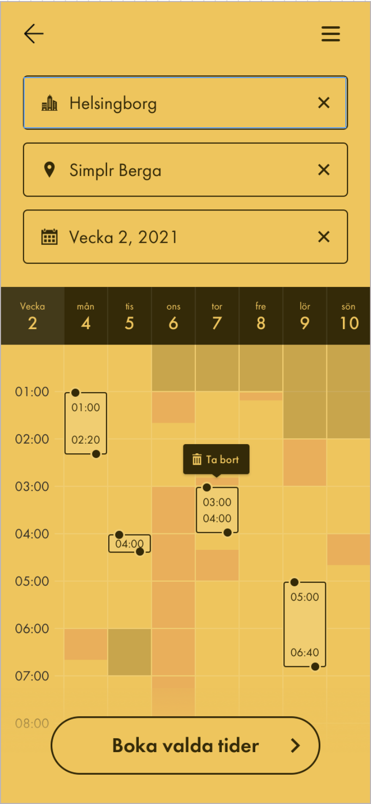
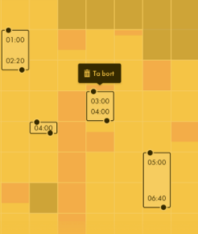
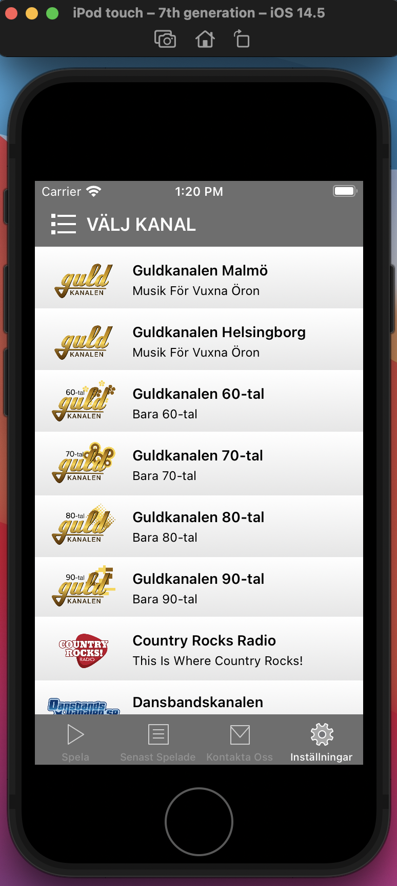
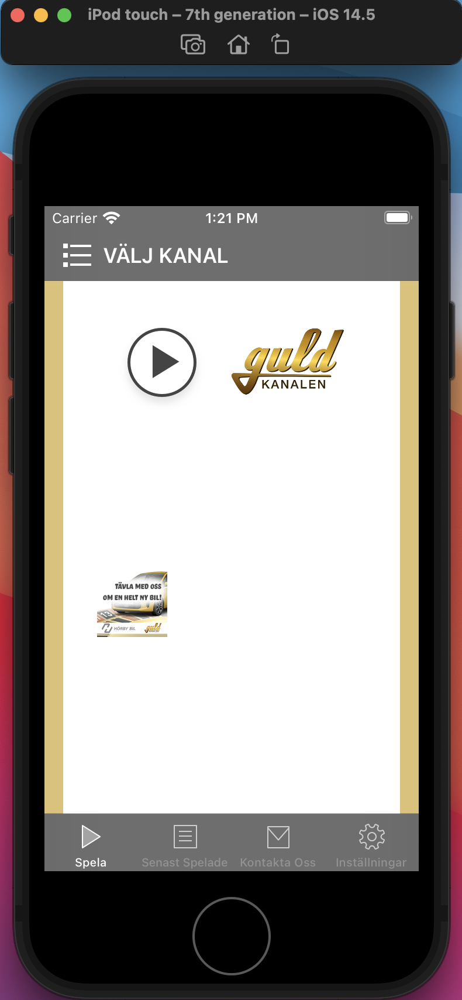
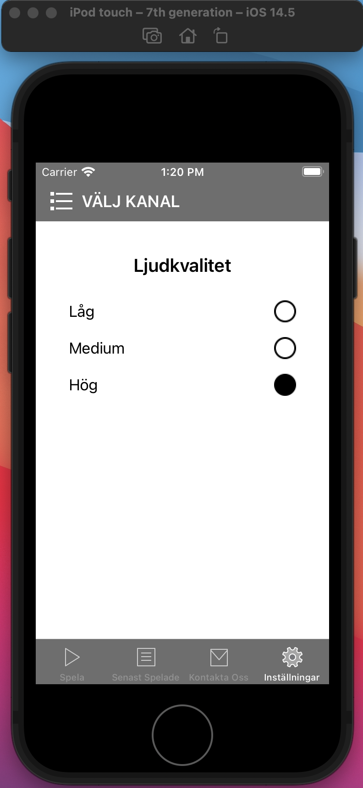
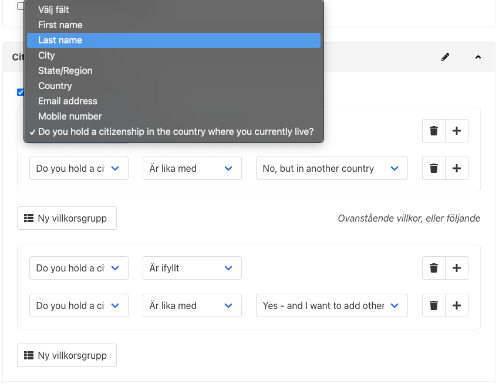
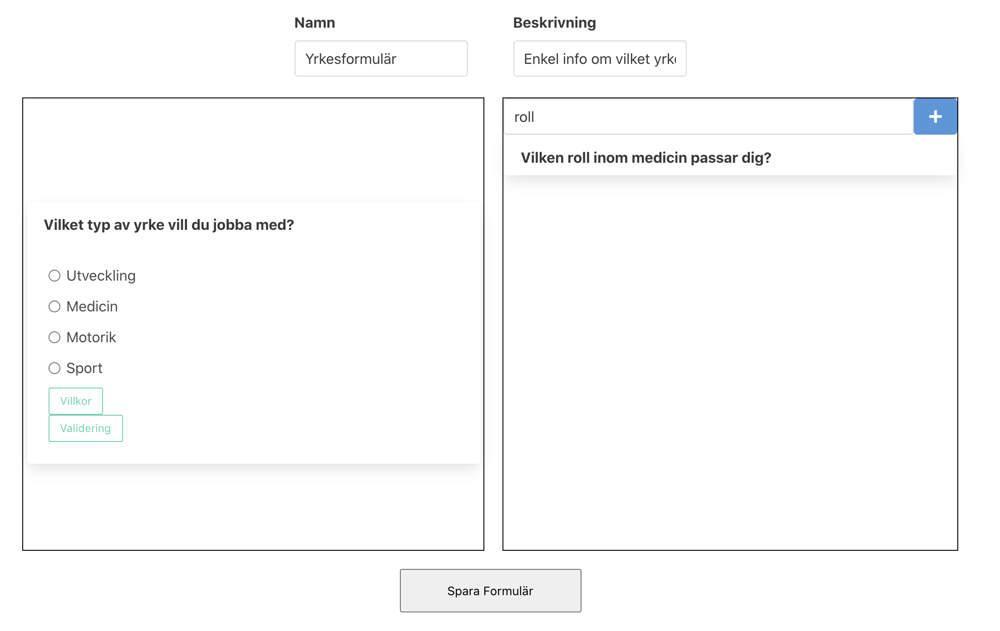
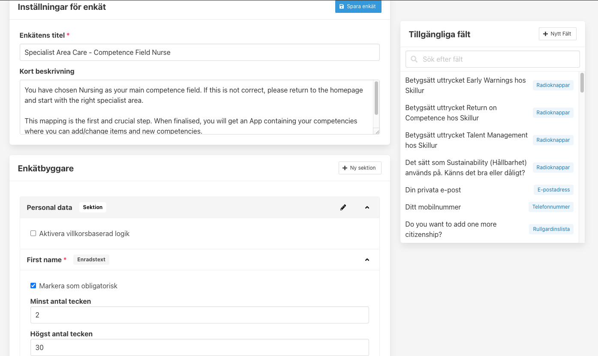

*Studerande: Hampus Olsen* <br>
*Handledare: Jonathan Lundström* <br>
*Datum: 8/3 till och med 28/5 - 2021*

<br/>
<br/>
<br/>
<br/>
<br/>
<br/>

<p align="center">
  <a href="https://ecsolutions.se/om-oss/">
    
  </a>
</p>

<br/>
<br/>
<br/>
<br/>
<br/>
<br/>

 <!-- omit in toc -->
# LIA 2, Webbutveckling
<br>

<!-- omit in toc -->
## Innehållsförteckning
<br>

- [LIA 2, Webbutveckling](#lia-2-webbutveckling)
- [Inledning](#inledning)
  - [Kursmål](#kursmål)
- [Frontendutveckling hos EC Utbildning](#frontendutveckling-hos-ec-utbildning)
- [EC Solutions &mdash; Trust the Experts!](#ec-solutions--trust-the-experts)
- [Simplr](#simplr)
  - [Schemaläggare à la Google Calendar](#schemaläggare-à-la-google-calendar)
- [Guldkanalen, Dansbandskanalen och Country Rock](#guldkanalen-dansbandskanalen-och-country-rock)
  - [iOS-utveckling](#ios-utveckling)
- [Skillur](#skillur)
  - [Enkätbyggare](#enkätbyggare)
- [Diskussion](#diskussion)
- [Utvärdering och Sammanfattning](#utvärdering-och-sammanfattning)

<br>
<br>

# Inledning
<br>

Som en del av programmet Frontendutveckling ingår två LIA-perioder (*Lärande i Arbete*) som innebär praktiktjänstgöring ute hos företag, med syfte att samla arbetslivserfarenhet innan examination. Både för att få insikt i vad yrkesrollen faktiskt innebär efter skolbänken och att få använda de kunskaper som förvärvats genom utbildningen. Mina mål för denna period är att fördjupa mig ytterligare i hela webbutvecklingsprocessen generellt.

<br>
<br>

## Kursmål

De specifika målen med denna kurs tagna direkt ur kursmålsdokumentet:

<br>

**Efter genomförd kurs ska den studerande ha kunskaper i/om:**

- Om att arbeta i projekt på en arbetsplats
- Om mjukvaruutveckling
- Om utveckling av webbapplikationer 

**Efter genomförd kurs ska den studerande ha färdigheter i att:**

- Kunna agera professionellt i ett team på en arbetsplats
- Använda effektiv kommunikation

**Efter genomförd kurs ska den studerande ha kompetens för att:**

- Kunna bygga en webbapplikation
- Självständigt kunna ta ansvar för sitt arbete utifrån en utsatt plan

<br>

[*Till innehållsförteckningen*](#innehållsförteckning)

<br>
<br>

# Frontendutveckling hos EC Utbildning
<br>

[Kreativitet, glädje och resultat](https://www.ecutbildning.se/om-ec/). Med dessa värdeord som grund strävar EC Utbildning att på bästa sätt förbereda intagna studenter för sina framtida yrkesroller. Genom kontinuerlig utvärdering och revidering av kursplaner och en nära relation till näringslivet kan bolaget försäkra sig om att elever får de kunskaper som efterfrågas i dagsläget. Ett smart drag som oftast leder till snabb anställning efter examen.

<br>

När jag lämnade in en sen anmälan under sommaren 2019 förstod jag inte hur lite jag visste om frontendutveckling, eller hur mycket jag skulle komma att få lära mig under det kommande året. Men vad jag visste efter att jag fick mitt positiva antagningsbesked var att jag verkligen ville dedikera min studietid åt att bli duktig på det. Vad som höll min motivation uppe detta gångna år var att jag konstant utmanades av ett högt men ändå hanterbart tempo, ett relevant kursmaterial och våra föreläsare, både kunniga och roliga.


<br>

[*Till innehållsförteckningen*](#innehållsförteckning)

<br>
<br>

# EC Solutions &mdash; Trust the Experts!
<br>

Företaget med kontor i Helsingborg, på första parkett mot Tropical Beach och således havet, tillsammans med människor som utstrålar kompetens och välvilja får en att känna sig varmt välkommen här. Även de dagar då diset ligger tjockt över Öresund och duggregnet piskar ansiktet värms man snabbt av en kopp nybryggt kaffe och en härlig atmosfär. En atmosfär präglad av känslan av att något är på gång, något skapas. Där finns en tydlig yrkesstolthet och passion för kunskapsutbyte.

<br>
<br>

> Vi stöder utvecklande företag med experttjänster inom mjuk- och hårdvaruutveckling, projektledning samt åtagande och leverans av helhetsuppdrag. Det självklara valet när ni står inför utmaningar och behöver teknikförstärkning!

<br>
<br>

Citatet ovan återfinns på [EC Solutions hemsida](http://www.ecsolutions.se/). Bolaget, som främst bedriver konsultverksamhet och rekrytering, har också ett arbetslag som arbetar inhouse på kontoret i Helsingborg vilket jag har varit en del av under LIA-perioden.

<br>

Inhouseavdelningen är mångsysslare som håller på med allt inom webbutveckling, maskininlärning och hårdvaruutveckling samt 3D-utskrift. Det sistnämnda har använts för att exempelvis [donera skyddsskärmar](https://www.linkedin.com/feed/update/urn:li:activity:6654020438877847552/) åt sjukvården.


<br>

[*Till innehållsförteckningen*](#innehållsförteckning)

<br>
<br>

# Simplr
<br>

Företagets affärsidé är att bistå och sköta bland annat frisersalonger där stolar kan bokas av frisörer för att utföra sitt arbete. Detta ger stor frihet för frisörer som slipper allt ansvar och administration som rör lokaler, betalning och marknadsföring bland annat, i utbyte mot en avgift för varje utförd klippning.

<br>

Projektet jag har varit delaktig i under hela perioden är en progressiv webbapplikation åt det nystartade företaget,  [ett systerbolag till Gents](https://simplr.se/about). Vi arbetade tillsammans med Gents utvecklingslag inför lanseringen av applikationens betaversion och de ansvarar för produktionssättning av den kod vi implementerar. Majoriteten av kodbasen på plats när jag kom in i projektet togs över efter en polsk firma. Dessvärre var produkten inte bara långt ifrån färdig, utan det som hade producerats var också undermåligt.

<br>

Där rådde initialt ingen officiellt etablerad arbetsprocess, utan det som gällde var helt enkelt att leverera en MVP-version (_Minimum viable product_) av produkten.

<br>

[*Till innehållsförteckningen*](#innehållsförteckning)

<br>
<br>

## Schemaläggare à la Google Calendar
<br>

Den mest omfattande och utmanande uppgiften under denna perioden har varit att bygga en vy där frisörerna har möjlighet att schemalägga sina veckor. En utmaning som webbutvecklare ofta ställs inför är att det ska fungera på inte bara lika enhetstyper (*desktop* och *mobile*), utan även på olika webbläsare. I vårt fall var det Mozillas Firefox, Microsofts Edge, Apples Safari och Googles Chrome som alla skulle stödjas. Speciellt Safari skulle, som väldigt ofta, visa sig ge oss stora problem.

<br>

Jag inledde uppgiften på egen hand, men efter att ha missat vårt estimat så bad jag om hjälp och en senior utvecklare kom in för att hjälpa mig. Dock så blev väldigt snabbt min seniora kollega också varse om att uppgiften var långt ifrån så enkel som den såg ut att vara när man bara tittar på vyns mockup.

<br>
<br>

<p align="center">
  
  <br>
  <em>Schemaläggarens mockup</em>
</p>

<br>
<br>

Som kan ses i mockup:en ovanför så är det väldigt mycket som ska tas in i beräkningar.

<br>

Överst har vi en sektion som ska hjälpa frisören att specificera salong och vecka, vilket kändes simpelt nog fram tills man kommer till insikten att den versionen av Material Design vi använde oss av inte har någon inställning för att välja veckor genom att endast trycka på en dag i den veckan. Där fanns en guide på hur detta kunde uppnås som inte riktigt fungerade som UX/UI-designern ville få det till, vilket jag löste med att skriva en slags middleware som omkapslade komponenten från Material Design.

<br>

När detta väl var löst fann jag en legacy bugg i hämtningen av frisörsdata för en viss period på specifik salong, och när jag började granska controllern som hanterade HTTP-anropet och SQL-anropet som det i sin tur kallade på så hittade jag flera mindre problem. Till slut beslutade vi att jag skulle skriva om både controllern och SQL-anropet då den existerande koden var så svårläst och dessutom fylld av mindre buggar som tillsammans gjorde ändpunkten väldigt opålitlig.

<br>

Efter att den övre sektionen väl stod färdig och korrekt data konsekvent gavs som svar på anropen så var det dags att börja bygga ut den undre sektionen.

<br>

Jag bröt upp mockupen i flera olika komponenter, funktioner och utmaningar för att kunna få en så bra uppfattning som möjligt över vad som skulle behövas göras. De grundläggande kraven för hur schemaläggaren skulle fungera var:

- Vid klick / tap på ett tillgängligt pass så ska passet och de två nästföljande placeras ut.
- Ett pass ska kunna redigeras genom att användaren drar i något av de två runda handtagen. Det övre handtaget expanderar passet upp och till vänster, det nedre nedåt och till höger.
- Flytt av pass ska aktiveras när en användare trycker och håller nere en viss tid. När flytt av pass är aktiverat ska användaren kunna dra runt passet och sen placera det genom att klicka.
- Om användaren klickar på ett utplacerat pass så ska "Ta bort"-knappen dyka upp ovanför passet.
- Om användaren expanderar passet över ej bokbara arbetspass så ska passet automatiskt delas upp i flera mindre pass.

<br>

Det tillkom flera krav under uppgiftens gång och bara ovanstående lista visade sig innebära en hel del komplex logik angående tekniska funktioner och arkitektonisk diskussion gällande vilken datastruktur som skulle vara mest optimal att använda. Viktiga aspekter inte minst när ett projekt är byggt i React, som hanterar omrenderingar på ett relativt långsamt och ineffektivt sätt i jämförelse med exempelvis Vue och Svelte. Slutresultatet blev hyffsat effektivt trots allt genom bra användning av memoization, mer specifikt genom React-funktionerna `memo`, `useCallback` och `useMemo` och att jag delade upp sektionen med alla pass i två lager, ett visuellt och ett interaktivt.

<br>
<br>

<p align="center">
  
  <br>
  <em>Schemaläggaren, sektionen med ett visuellt och ett interaktivt lager</em>
</p>

<br>
<br>

Det interaktiva lagret bestod endast av ett tomt `<div>`-element till vilket jag kopplade på en rad lyssnare på olika `onpointer`-händelser. För att lösa fallen med längre tryck så hade komponenten en `setTimeout` vars id sparades i en referens som sattes igång på `onpointerdown`, och som vid `onpointermove` eller `onpointerup` avbröts.

<br>

Funktionen som lyssnade på `onpointermove` hade den kanske mest vitala och komplexa logiken, vilket var att översätta muspositioner till indexpositioner och ge dessa till kontextet som i slutändan kunde använda dessa för att peka på olika pass-objekt och ändra deras tillstånd. När dessa ändrades gav det då utslag i det undre visuella lagret som ändrade stilmallen för att tydligt presentera för användaren hur dess interaktionen påverkat datan.

<br>

[*Till innehållsförteckningen*](#innehållsförteckning)

<br>
<br>

# Guldkanalen, Dansbandskanalen och Country Rock
<br>

Radiokanalerna med VD:n som valt att stava Bengtsson med två z:n, och som en gång i veckan bjuder på smarriga recept av kocken Martin Hansen som är flerfaldig finalist i Årets Kock men aldrig vunnit. Hallåarna Anna Bystedt, Henrik (inte att förknippa med Henke) Wiberg och Per-Ola Sandberg blir snabbt en del av din familj med sitt trivsamma mellansnack och humorösa eskapader.

<br>

Guldkanalen erbjuder allt från 70-talsmusik till mer moderna dängor. Country Rock kommer få dig att headbanga och spela luftgitarr. Dansbandskanalen har ett brett utbud av band med svenska manliga dubbelnamn. Behöver jag säga mer?

<br>

Min personliga favorit under utvecklingstiden har varit Dansbandskanalens Julmusik som spelar jullåtar året runt!

<br>

[*Till innehållsförteckningen*](#innehållsförteckning)

<br>
<br>

## iOS-utveckling
<br>

Det råkade vara så att bolaget numera inte hade tillgång till källkoden för sin applikation då den förre utvecklaren under en längre tid visat sig vara okontaktbar. Projektet innebar initialt att helt enkelt bygga om appen med en modern kodbas men som visuellt skulle se ut mer eller mindre exakt som den gör i dag. Jag arbetade nära en annan kollega som tog sig an Android-utvecklingen av applikationen. Medan jag inte hade någon tidigare erfarenhet av iOS-utveckling eller mobil apputveckling generellt så var det väldigt spännande att få ge sig på.

<br>

Vi fick en estimering på exakt två veckor för att nå vårt mål eftersom det ansågs vara en hyffsat simpel applikation. Vi fick information att eventuellt skulle där ske mindre visuella ändringar när vi var klara, så med det i åtanke och för att inte skjuta oss själva i foten lade vi fokus på att få in all tidigare funktionalitet först och främst.

<br>

I stora drag bestod applikationen av fyra vyer samt en meny för att välja kanal:
- Meny, lista över tillgängliga radiokanaler
- Radio / Spelare, kontroll av ljud och annonser
- Senaste Spelade, en lista av de 30 senast spelade låtarna
- Kontakt, formulär för att skicka mail till respektive radiokanal
- Inställningar, för att kunna ändra ljudkvalitet

<br>
<br>

<p align="center">
  
  
  
  <br>
  <em>Vyerna (fv.) Meny, Radio, Inställningar</em>
</p>

<br>
<br>

Att gå från webbutveckling, speciellt där fokus utan tvekan lagts på React, så har jag blivit van vid ett speciellt tänk om hur applikationer byggs upp, hur tillstånd hanteras och uppdateras, och så vidare... Det var därför med stor glädje som jag tog mig an denna uppgiften.

<br>

För mig innebar det två nya syntax (Swift och Objective-C) samt en helt ny utvecklingsmiljö. Eftersom att Apple som vanligt är lite småaktiga så har de gjort det i princip omöjligt att utveckla appar för iOS utan att använda just deras IDE, Xcode. I början så kan jag nog sträcka mig så långt som att säga att jag hatade Xcode och Apple's dokumentation. Numera ogillar jag det bara. En solklar förbättring!

<br>

De stora skillnaderna bortsett från syntax och utvecklingsmiljö webbutveckling kontra apputveckling är enligt mig hur vyer komponeras och placeras och hur tillstånd hanteras. I ett försök att förklara skillnaderna ut en webbutvecklares perspektiv så använder sig iOS-applikationer av något som kallas för *constraints*, eller då begränsningar på svenska, för att bestämma hur en vy ska placeras. Vilket egentligen inte liknar något som används i webbutveckling men för sakens skull kan likna med `margin` och `padding` attributen i de stilmallar vi är vana vid att skriva.

<br>

I apputveckling så pågår det också en skifte vad gäller komponenters arkitektoniska standard från att använda sig av MVC (Model-View-Controller) till MVVM (Model-View-ViewModel), men återigen med vår applikations enkelhet i åtanke vände jag mig till att använda MVC vilket är ett koncept jag är bekväm med och enkelt kunde dra paralleller till hur React-komponenter används tillsammans med kontext och `useReducer`.

<br>

Allting är också vyer. Ett grovt förenklat exempel skulle vara som följande HTML- och Swift-struktur.

<br>

HTML
```html
<main>
  <h1>My life as a horse<h1>
  <p>
    I'm a horse! <span>Gnnggeeuuugh</span>
  </p>
</main>
```

<br>

Swift / Objective-C
```xml
<UIViewController>
  <UIView>
    <UIView>My life as a horse</UIView>
    <UIView>
      I'm a horse <UIView>Gnnggeeuuugh</UIView>
    </UIView>
  </UIView>
</UIViewController>
```

<br>

Där finns alltså ingen direkt semantik på samma sätt som det finns i HTML, så det enklaste sättet att tänka på det är som att alla element bara är `<div>`-element. Och precis som det går att förlänga klasser i JavaScript så förlänger man alltså dessa vy-klasserna när man skapar sina egna vyer. Självklart finns där en hel del olika typer av förlängda vyer att tillgå inbyggt i ramverket UIKit, som håller på att fasas ut och ersättas av SwiftUI i mer moderna applikationer. På grund av att vår målgrupp ofta använder äldre modeller av iPhones och med ibland utdaterade operativsystemversioner så kunde vi inte använda SwiftUI och var därmed begränsade till UIKit. Vilket inte påverkade mig i min process mer än att det var marginellt svårare att hitta dokumentation för UIKit gentemot SwiftUI.

<br>

När drygt två veckor hade passerat så fick vi de nya designförslagen från kunden, vilka visade på betydligt större ändringar än vad som initialt kommunicerats. Design som vi varken tyckte såg anständig ut eller som vi ansåg fungerande rent UX-mässigt. Därför har projektet lagts på is tills vi arbetat fram en lösning som både vi kan vara stolta över, kunden är nöjd med och som de faktiskt är villiga att betala för.

<br>

[*Till innehållsförteckningen*](#innehållsförteckning)

<br>
<br>

# Skillur
<br>

Det senaste projektet som jag sitter med även nu är för bolaget Skillur, som ägnar sig åt kompetenskartläggning. För att kunna göra detta så använder de sig primärt av olika enkäter som besvaras online, vars svar de senare kan analysera och jämföra mot arbetsmarknaden på olika sätt. Uppdraget är att skapa en prototyp för ett verktyg som gör det enkelt för dem att bygga avancerade enkäter som levererar en hög svarsgrad.

<br>

[*Till innehållsförteckningen*](#innehållsförteckning)

<br>
<br>

## Enkätbyggare
<br>

När jag kom in i projektet hade det passerat två andra kollegor redan suttit med det i totalt 4 månader. Eftersom jag bollat lite idéer och hjälpt till med lösningar på ett fåtal problem tidigare så visste jag lite vad projektet handlade om och hade ett hum om hur det önskade resultatet skulle se ut. Efter en veckas arbete var det dags för kundmöte och det var då som vi fick reda på att något väldigt grundläggande hade missats.

<br>

Mina medarbetare hade tidigare byggt ett väldigt stängt system vilket gjorde att det var väldigt svårt att lägga till fler fälttyper, exempelvis `number`, `phone`, `email`, och så vidare... Något som egentligen borde gjorts väldigt enkelt och som var några baskrav kunden satt från början. Dessa var, om krångligt, inga större problem att kila in i prototypen. Men när kunden nämnde att flera fält måste kunna ingå i sektioner så tittade jag förbryllat på mina kollegor, och såg då att detta var något de missat. Detta var ingenting man kilade in en lösning på utan det kom att ändra hur allting fungerade. En annan väldigt central och omfattande del var att alla fält skulle kunna ha regler för validering och villkorlig rendering av fält, där villkorlig rendering innebär att om ett fält visas eller inte beror på hur tidigare frågor besvarats. Detta för att dölja irrelevanta frågor för att den som besvarar enkäten inte ska bli överväldigad av antalet frågor initialt.

<br>

Det var bara för oss att bita i det sura äpplet och göra om och göra rätt.

<br>

Jag fick då ta lead på projektet och presenterade en lösning som har visat sig vara betydligt mer dynamisk och öppen för ändringar. Sedan gallrade jag bland kundens extra önskemål och hade en diskussion med min handledare om vad som kunde anses vara funktioner som ingick i prototypen och vad som är för stora för att få med just nu.

<br>

En aspekt jag tyckte var väldigt rolig och intressant att jobba med var just den villkorsbaserade logiken. I princip så gällde det alltså att kunna spara olika typer av villkor i databasen, för att sedan använda dessa i vyn där enkäten besvaras. Jag kom fram till att vi behövde spara identifikationsnummer på det fält som villkoret baseras på, vilken villkorsoperatör som skulle användas samt värdet som skulle användas för att jämföra svaret mot. I kravet ingick stöd för de logiska operatörerna `&&` *(OCH)* och `||` *(ELLER)*, samt villkorsoperatörerna `===` *(LIKA MED)*, `!==` *(INTE LIKA MED)*, `!` *(OGILTIGT VÄRDE)* och `!!` *(GILTIGT VÄRDE)*.

<br>
<br>

<p align="center">
  
  <br>
  <em>Delen av gränssnittet där villkorsbaserad rendering definieras</em>
</p>

<br>
<br>

*Datastruktur i JSON-format för exemplet ovan*
```json
[
  [
    { "fieldId": "<UUID>", "operator": "!!", "value": null },
    { "fieldId": "<UUID>", "operator": "===", "value": "No, but in another country" },
  ],
  [
    { "fieldId": "<UUID>", "operator": "!!", "value": null },
    { "fieldId": "<UUID>", "operator": "===", "value": "Yes - and I want to add another" },
  ]
]
```

<br>
<br>

För att sedan bestämma huruvida en fråga skulle renderas ut eller inte så loopas listan av villkorsgrupper genom och kollar om varje villkor returnerar värdet `true`. Om så är fallet visas frågan, annars förblir den gömd.

<br>

Efter tre tuffa veckor hade vi inte bara börjat om från start och kommit ikapp, utan fått fram med en betydligt bättre produkt som kommer agera som en stabil och öppen grund att bygga vidare på.

<br>
<br>

<p align="center">
  
  <br>
  <em>Gamla vyn för enkätbyggaren</em>
</p>

<br>
<br>

<p align="center">
  
  <br>
  <em>Nya vyn för enkätbyggaren som visar en sektion</em>
</p>

<br>
<br>

[*Till innehållsförteckningen*](#innehållsförteckning)

<br>
<br>

# Diskussion
<br>

En av de absolut mest vitala delar i ett företag, oavsett bransch, är kommunikation. Systemutveckling är inget undantag. [Kommunikation inom företagande brukar delas upp i två kategorier](https://keydifferences.com/difference-between-internal-and-external-communication.html); både en intern och en extern dialog fördes kontinuerligt under hela perioden. Var kategori av kommunikation kan också föras i flera riktningar, och i varierad ton. Ett faktum som varken överraskade eller gjorde mig obekväm, då jag har mycket kommunikativ erfarenhet från tidigare yrkesroller. Det som däremot var helt nytt för mig var hur det används inom denna bransch, och speciellt hos EC Solutions.

<br>

Denna perioden har jag fått vara med vid betydligt fler kundmöten, vilket har gjort att jag fått en ofiltrerad inblick i kundens förväntningar och krav. Till skillnad från den första LIA-perioden så har jag börjat våga ställa mer krav själv, som utvecklare. Är specifikationen inte utömmande så kräver jag en mer utförlig förklaring. Känner jag direkt att UX/UI-designern eller kunden har orealistiska förväntningar så flaggar jag för det och försöker tillsammans finna en godtagbar kompromiss genom att erbjuda ett för inom projektets ramar genomförbara uppgifter. Insikten om att *jag* är utvecklaren och att det är *jag* som faktiskt vet vad arbetet innebär att få fram en viss funktionalitet eller design, och därför också har skyldighet att sätta stopp när saker skenar iväg. Precis som konstruktörer ibland behöver stoppa arkitekter för att använda en metafor kopplat till byggsektorn. Det är en väldigt härlig insikt att komma till, och något som ökat mitt självförtroende enormt.

<br>

Retrospektivt så kan jag se tillbaka på denna perioden och känna att mina erfarenheter verkligen sammastrålar perfekt med kursmålen:

<br>

I [Skillur](#skillur) och [Simplr](#simplr) har jag använt helt olika teknologier för att bygga två väldigt olika webbapplikationer. Båda med sin egen typ av komplexitet.

- [x] Om utveckling av webbapplikationer 
- [x] Kunna bygga en webbapplikation

<br>

Under hela arbetet med [Skillur](#skillur) har jag arbetat väldigt nära en annan kollega och fått ta teknisk ledning på projektet. Där jag bland annat fått dela med mig av mina kunskaper inom versionshantering *(Git)*, React och programmering generellt. Vi har alltid haft en god ton mot varandra och skrattat mycket tillsammans och är i dag mycket närmre kollegor än vi var tidigare, vilket är mycket härligt!

- [x] Om att arbeta i projekt på en arbetsplats
- [x] Kunna agera professionellt i ett team på en arbetsplats

<br>

I [Guldkanalen](#guldkanalen-dansbandskanalen-och-country-rock) fick jag även på en relativt kort tid lära mig en hel del om iOS- och Android-utveckling i sammarbete med en kollega.

- [x] Om mjukvaruutveckling

<br>

I kundmöten och intern dialog med båda chefer och medarbetare så har jag fått en chans att använda mig av de erfarenheter jag hade i kommunikation från tidigare yrken. Att alltid vara ödmjuk och förstående men ändå realistisk och förhålla sig objektivt till en situation. Ett enligt mig väldigt professionellt sätt att kommunicera på.

- [x] Använda effektiv kommunikation

<br>

[*Till innehållsförteckningen*](#innehållsförteckning)

<br>
<br>

# Utvärdering och Sammanfattning
<br>

Överlag har jag varit väldigt nöjd med min praktiktjänst och känner att min upplevelse har varit en perfekt chans att verkligen få känna på hur livet som utvecklare är. Sedan jag påbörjade detta programmet så har jag efter varje avklarad uppgift sett till att repetera den flera gånger. För varje repetition har jag lärt mig något nytt och känner att det varit en av de största bidragande faktorerna till att jag står där jag gör i dag. Under LIA-perioden har jag inte haft chans till detta eftersom pressen att ta en ny uppgift på sig när en annan är färdig alltid funnits där. Inte på ett dåligt sätt, utan mest bara för att det inte är ekonomiskt försvarbart inför kund att göra om något som faktiskt fungerar, och gör det väl, bara för att försöka uppnå något som är marginellt bättre.

<br>

Hos EC Solutions har jag fått träffa och lära känna människor med professionella bakgrunder inte bara inom webbutveckling, och har fått höra om många andra spännande utvecklingsområden. Redan innan praktiken började hade jag börjat bli nyfiken på fullstackutveckling, och nu när praktiken är över har jag kommit till insikt med att min nyfikenhet inte heller stannar där, utan omfattar utveckling generellt. Kanske vill jag till och med gå så långt att beskriva det som att den novisa nyfikenheten som fick mig att lämna in en sen anmälan sommaren innan jag påbörjade utbildningen, har nu växt till ett professionellt intresse.

<br>

[*Till innehållsförteckningen*](#innehållsförteckning)

<br>
<br>