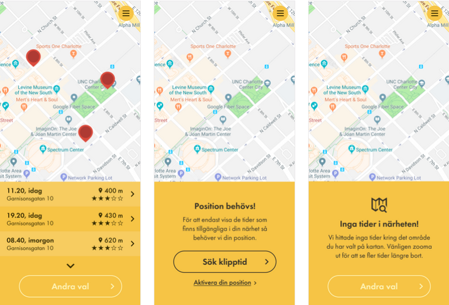
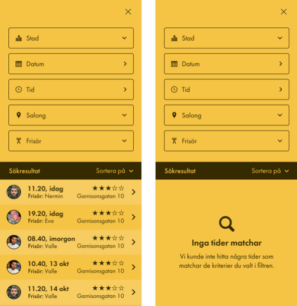

*Studerande: Hampus Olsen* <br>
*Handledare: Jonathan Lundström* <br>
*Datum: 21/9 till och med 10/12 - 2020*

<br/>
<br/>
<br/>
<br/>
<br/>
<br/>

<p align="center">
  <a href="https://ecsolutions.se/om-oss/">
    
  </a>
</p>

<br/>
<br/>
<br/>
<br/>
<br/>
<br/>

 <!-- omit in toc -->
# LIA 1, Webbutveckling
<br>

<!-- omit in toc -->
## Innehållsförteckning
<br>

+ [LIA 1, Webbutveckling](#lia-1-webbutveckling)
+ [Inledning](#inledning)
  + [Kursmål](#kursmål)
  + [Presentationsformat](#presentationsformat)
+ [Frontendutveckling hos EC Utbildning](#frontendutveckling-hos-ec-utbildning)
+ [EC Solutions &mdash; Trust the Experts!](#ec-solutions--trust-the-experts)
+ [Simplr](#simplr)
+ [Veckoindelad Rapportering](#veckoindelad-rapportering)
  + [_Vecka 1_](#vecka-1)
      + [End of Line](#end-of-line)
  + [_Vecka 2_](#vecka-2)
      + [Analys av Datumsträngar](#analys-av-datumsträngar)
      + [Windows Subsystem for Linux (WSL)](#windows-subsystem-for-linux-wsl)
  + [_Vecka 3_](#vecka-3)
      + [WYSIWYG - What you see is what you get](#wysiwyg---what-you-see-is-what-you-get)
  + [_Vecka 4_](#vecka-4)
      + [Clean Code with Uncle Bob](#clean-code-with-uncle-bob)
      + [Deep Dive into Git](#deep-dive-into-git)
  + [_Vecka 5_](#vecka-5)
      + [Service Worker](#service-worker)
      + [Web Application Manifest](#web-application-manifest)
  + [_Vecka 6_](#vecka-6)
      + [Laravel](#laravel)
  + [_Vecka 7 och 8_](#vecka-7-och-8)
      + [Floating-point error](#floating-point-error)
  + [_Vecka 9 och 10_](#vecka-9-och-10)
+ [Diskussion](#diskussion)
+ [Utvärdering och Sammanfattning](#utvärdering-och-sammanfattning)

<br>
<br>

# Inledning
<br>

Som en del av programmet Frontendutveckling ingår två LIA-perioder (*Lärande i Arbete*) som innebär praktiktjänstgöring ute hos företag, med syfte att samla arbetslivserfarenhet innan examination. Både för att få insikt i vad yrkesrollen faktiskt innebär efter skolbänken och att få använda de kunskaper som förvärvats genom utbildningen. Mina mål är att fördjupa mig ytterligare i hela webbutvecklingsprocessen generellt och React-biblioteket specifikt.

<br>
<br>

## Kursmål

De specifika målen med denna kurs tagna direkt ur kursmålsdokumentet:

<br>

**Efter genomförd kurs ska den studerande ha kunskaper i/om:**

- I skissning av wireframe 
- I projekthantering och kommunikation 
- I utveckling av programvara 

**Efter genomförd kurs ska den studerande ha färdigheter i att:**

- Kunna tillämpa grafiska applikationer och layouter med HTML, CSS och JavaScript 
- Självständigt tänka ut hur man gör för att förädla webbsidor med frontend tekniker  

**Efter genomförd kurs ska den studerande ha kompetens för att:**

- Få praktisk erfarenhet i att arbeta i arbetslivet med planering, utveckling och eget ansvarstagande 
- Arbeta självständigt med utveckling i HTML, JavaScript och CSS   
- Utveckla professionellt förhållningssätt till sitt kommande yrke genom direkta erfarenheter i arbetslivet. 


<br>
<br>

## Presentationsformat
<br>

Min rapportering av tiden hos EC Solutions presenteras veckovis. Varje veckorapport består av en omfattande summering av veckan som varit. Följande inkluderas det under egna rubriker kortare analyser, reflektioner, eller presentationer relevanta till veckan som gått.

Rapporten är skriven i språket [Markdown](https://www.markdownguide.org/getting-started/) som är ett formateringsspråk för textdokument. Till skillnad från textredigeringsprogram som Microsoft Word och Apache Open Office där du ändrar inställningar för formatering genom att klicka på knappar, välja från en rullgardinslista eller kryssa i en checklista, så [används speciella tecken för att definiera formatering](https://www.markdownguide.org/basic-syntax/). Detta är en industristandard för att skriva både dokumentation och rapporter inom, men inte begränsat till, systemutveckling. Formateringen är även populär bland bloggare och författare [eftersom det är plattformsagnostiskt](https://www.markdownguide.org/getting-started/#why-use-markdown), eftersom det i grunden bara är vanlig text.

Två stora fördelar som ofta nämns är just att det går att öppna och redigera Markdown-filer i vilket textredigeringsprogram som helst, eftersom det bara är ren text, till skillnad från exempelvis filer skapade med Microsoft Word (.docx) eller Apache OpenOffice (.odt). Markdown stöds även helt eller delvis i webbapplikationer som exempelvis [Slack](https://www.markdownguide.org/tools/slack/) och [stackoverflow](https://stackoverflow.com/).

<br>
<br>

# Frontendutveckling hos EC Utbildning
<br>

[Kreativitet, glädje och resultat](https://www.ecutbildning.se/om-ec/). Med dessa värdeord som grund strävar EC Utbildning att på bästa sätt förbereda intagna studenter för sina framtida yrkesroller. Genom kontinuerlig utvärdering och revidering av kursplaner och en nära relation till näringslivet kan bolaget försäkra sig om att elever får de kunskaper som efterfrågas i dagsläget. Ett smart drag som oftast leder till snabb anställning efter examen.

När jag lämnade in en sen anmälan under sommaren 2019 förstod jag inte hur lite jag visste om frontendutveckling, eller hur mycket jag skulle komma att få lära mig under det kommande året. Men vad jag visste efter att jag fick mitt positiva antagningsbesked var att jag verkligen ville dedikera min studietid åt att bli duktig på det. Vad som höll min motivation uppe detta gångna år var att jag konstant utmanades av ett högt men ändå hanterbart tempo, ett relevant kursmaterial och våra föreläsare, både kunniga och roliga.

<br>
<br>

# EC Solutions &mdash; Trust the Experts!
<br>

Företaget med kontor i Helsingborg, på första parkett mot Tropical Beach och således havet, tillsammans med människor som utstrålar kompetens och välvilja får en att känna sig varmt välkommen här. Även de dagar då diset ligger tjockt över Öresund och duggregnet piskar ansiktet värms man snabbt av en kopp nybryggt kaffe och en härlig atmosfär. En atmosfär präglad av känslan av att något är på gång, något skapas. Där finns en tydlig yrkesstolthet och passion för kunskapsutbyte.

<br>

> Vi stöder utvecklande företag med experttjänster inom mjuk- och hårdvaruutveckling, projektledning samt åtagande och leverans av helhetsuppdrag. Det självklara valet när ni står inför utmaningar och behöver teknikförstärkning!

<br>

Citatet ovan återfinns på [EC Solutions hemsida](http://www.ecsolutions.se/). Bolaget, som främst bedriver konsultverksamhet och rekrytering, har också ett arbetslag som arbetar inhouse på kontoret i Helsingborg vilket jag har varit en del av under LIA-perioden.

Inhouseavdelningen är mångsysslare som håller på med allt inom webbutveckling, maskininlärning och hårdvaruutveckling samt 3D-utskrift. Det sistnämnda har använts för att exempelvis [donera skyddsskärmar](https://www.linkedin.com/feed/update/urn:li:activity:6654020438877847552/) åt sjukvården.

<br>
<br>

# Simplr
<br>

Företagets affärsidé är att bistå och sköta bland annat frisersalonger där stolar kan bokas av frisörer för att utföra sitt arbete. Detta ger stor frihet för frisörer som slipper allt ansvar och administration som rör lokaler, betalning och marknadsföring bland annat, i utbyte mot en avgift för varje utförd klippning.

Projektet jag har varit delaktig i under hela perioden är en progressiv webbapplikation åt det nystartade företaget,  [ett systerbolag till Gents](https://simplr.se/about). Vi arbetade tillsammans med Gents utvecklingslag inför lanseringen av applikationens betaversion och de ansvarar för produktionssättning av den kod vi implementerar. Majoriteten av kodbasen på plats när jag kom in i projektet togs över efter en polsk firma. Dessvärre var produkten inte bara långt ifrån färdig, utan det som hade producerats var också undermåligt.

Där rådde initialt ingen officiellt etablerad arbetsprocess, utan det som gällde var helt enkelt att leverera en MVP-version (_Minimum viable product_) av produkten.

<br>
<br>

# Veckoindelad Rapportering
<br>

## _Vecka 1_
<br>

Veckan innan jag började hade jag fått en generell beskrivning av projektet jag initialt kom att arbeta med: 

> "... onödigt komplexa abstraktionslager, fylld av buggar och går ut i produktion nästa måndag."

<br>

*"Kul,"* var min första tanke samtidigt som en nervositet byggdes upp inombords.

Måndagen började med att jag, guidad av en senior kollega, skulle sätta upp utvecklingsmiljön på min dator så att jag kunde börja beta av uppgifter från kanban-brädet på Trello. Eftersom att jag var den enda i arbetslaget som använde operativsystemet Windows, visade det sig finnas en hel del saker som inte fungerade med konfigurationen av utvecklingsmiljön. En av de större huvudbryerna handlade om hur tolkning av radändelser skiljde sig åt mellan de olika systemen. Tillsammans löste vi fel efter fel av fram tills att vi fått igång både backend och klient. Som bonus besatt vi nu kunskap om vad för slags ändringar av konfigurationen som krävdes. Skulle där i framtiden komma in fler utvecklare med Windows skulle de i så fall inte behöva spendera lika mycket tid på operativsspecifika problem innan de kommer igång.

Resten av dagen spenderade jag med att sätta mig in i projektets arkitektur. Eftersom kodens abstraktionsgrad var väldigt hög, en av orsakerna till dess höga komplexitet, tog detta resten av dagen. Namngivelser var väldigt otydliga samtidigt som komponenter ofta gav sken att vara generiska, men kunde i själva verket inte användas på mer än ett eller två specifika ställen. Så för att göra väldigt enkla justeringar var man ofta tvungen att ändra kod i väldigt många filer.

På tisdagen började jag ta på mig uppgifter från kanban-brädet, och därefter rullade veckan på rätt så bra och bestod mestadels av att skriva enklare algoritmer, fixa buggar och att förbättra användareupplevelsen med hjälp av att implementera ny gränssnittsdesign. Efter en tuff men väldigt intressant första vecka så var produkten på fredagen stabil nog att en demo kunde visas upp för slutkunder på måndagen.

_Frihet under ansvar_. Ett talesätt jag kom att tänka på medan första veckan led mot sitt slut. Ett talesätt som kom att prägla resten av LIA-perioden.

<br>

<!-- omit in toc -->
### Veckans Lärdommar

#### End of Line

Med _end of line_ syftar man på, som namnet tyder, en radändelse. Det är viktigt att känna till detta eftersom radändelser fungerar olika på olika system, och kan skapa stora och svårfunna problem exempelvis när ett operativsystem med UNIX-kärna ska köra en shell-fil skriven i ett operativsystem med DOS-kärna.

<br> 

[*Till innehållsförteckningen*](#innehållsförteckning)

<br>
<br>

## _Vecka 2_
<br>

Den andra veckan började som den första slutade. Jag fortsatte med att hjälpa till och avverka uppgifter som låg i prio-listan på Trello, samtidigt som jag vidareutvecklade föregående funktionalitet jag lagt till så fort feedback kom tillbaka på dem. Något som jag tyckte var mycket nyttigt och ofta snabbt kunde lösa.

Mot veckans slut hade jag tröttnat rejält på att min dator var så oerhört långsam. Under hela tiden fram tills nu så låg datorns minneskonsumtion på 95~99% medan jag arbetade på projektet, och fann då att det var Docker-Engine som var boven i dramat. Jag lade temporärt arbetet åt sidan för att kunna felsöka problemet, så att jag därefter kunde arbeta mer effektivt. Windows Subsystem for Linux studerades noggrant, systemet som möjliggör så att Docker kan köras på Windows, och kom fram till att lösningen på problemet var tvådelat: installera Ubuntu som är ett operativsystem för Linux och strypa de resurser som Docker har tillgång till.

Genom Ubuntu ökades effektiviteten på Docker-Engine vilket gjorde att jag kunde begränsa minnet och antalet processorkärnor som motorn kunde använda sig av ***utan*** att tappa prestanda på utvecklingsservern, och efter det var min effektivitet inte begränsad av datorns kapacitet längre. Vilket kommer spara mig många timmar och frustration under resten av LIA-perioden.  

<br>

<!-- omit in toc -->
### Veckans Lärdommar

#### Analys av Datumsträngar
`Date.parse()`-metoden som körs när ***du kallar på deklarerar*** ett ny instans av `Date`-klassen med ett strängargument, har [ett väldigt inkonsekvent beteende](https://developer.mozilla.org/en-US/docs/Web/JavaScript/Reference/Global_Objects/Date/parse) och fungerar exempelvis annorlunda i Safari jämfört med andra webbläsare. Därför bör alltid `Date`-konstruktorn kallas med nummer-argument för att vara säker på samma resultat oberoende av webbläsare. Fördelen med att göra detta är att webbläsarspecifik felhantering kan utelämnas.

<br>

_Exempel på användning_

```javascript
new Date("1988-12-20") // Osäker instatiering
new Date(1988, 12, 20) // Säker instatiering
```
 
<br>

#### Windows Subsystem for Linux (WSL)
WSL är ett kompabilitetslager för att kunna exekvera binära Linux-program. Byggt på Hyper-V som är skapat av Microsoft för att kunna skapa virtuella miljöer. Något som bör göras för varje projekt med mer än en tänkt utvecklare. För att konfigurera sin dators resurser som WSL får lov att tillgå så skapar man en `.wslconfig` i sin användarmapp. Begränsas inte dessa resurser kommer den virtuella miljön helt enkelt ta så mycket som finns tillgängligt och reservera detta om det skulle behövas. Något som absolut är fördelaktigt för en server, men inte för en lokal miljö på samma moderkort som utvecklingsarbete sker.

<br>

_Exempel på en enkel .wslconfig-fil_

```
[wsl<versionsnummer>]
memory=<nummer>GB
processors=<nummer>
swap=<nummer>GB
```

<br>

[*Till innehållsförteckningen*](#innehållsförteckning)

<br>
<br>

## _Vecka 3_
<br>

Väl tillbaka på kontoret efter helgen tar en senior kollega upp vissa problem med den nuvarande arbetsprocessen som till stora delar rör sig om Git, men också implementering av saker som översättningar och dynamiskt skapade sidor. Vi bestämmer oss för att ta upp en del åsikter med kunden, för att se hur de prioriterar. Senare i veckan bestäms ett nytt flöde för Git som vi internt inte håller med om är nödvändigt och anser bara bidrar till en mer svårhanterligt flöde, men som vi rättar oss efter. Personligen hade jag ingen åsikt på grund av min bristande erfarenhet gällande Git och de olika arbetsmetodiker kopplade till det, men glädes ändå för den nyligen fastställda processen eftersom det innebar att jag skulle få möjlighet att lära mig ännu mer om Git.

Det nya arbetsflödet innebar att varje utvecklingslag som kommer att jobba mot samma projekt klonar koden som ligger i produktionsstadiets huvudgren till en egen kodförvaring, hädanefter _repo_ (förkortat från _repository_ som betyder _förvaring_). Efter det klonar var utvecklare själv ned lokalt huvudgrenen för sitt lags repo, och grenar utifrån den när en ny uppgift ska tas an och namnger grenen med typ av uppgift och namnges koncist. Arbetar man exempelvis med att fixa en bug som ska lösa ett problem som uppstår i en betalningsfunktion så kan den heta `fix/payment-handler`. Namnet på grenen är bara viktigt tills det att den förenas med huvudgrenen; när uppgiften anses vara slutförd tas den bort efter förening.

<br>
<br>

```shell
git checkout -b <namn>

// Utför uppgift

git add <sökväg>
git commit -m "<beskrivning>"

// Ifall pre-commit hooken hittar problem så ska de lösas här och följs sen av de kommenterade kommandona nedan
// git add <sökväg>
// git commit --amend --no-edit

git fetch upstream --all
git rebase upstream/master

// Lös eventuella krockar med kod i produktionsbasen
// git add <sökväg>
// git rebase --continue

git push origin <namn>

// Skapa en föreningsbegäran och delge projektansvarig

git checkout <huvudgren>
```
_Exempel på det nya flödets livscykel för en uppgift och utgår från ens lokala huvudgren_

<br>
<br>

Flödet motiverades i slutändan av viljan att ha en helt linjär historik över commits i produktionsträdet, något som används flitigt inom _Open Source_-communityn. Ytterligare ett skäl till att jag blev exalterad över att just denna metodiken valdes då jag under ett tag nu varit intresserad av att bidra till diverse projekt.

<br>

<!-- omit in toc -->
### Veckans Lärdommar

#### WYSIWYG - What you see is what you get

En fras som kanske inte alltid kopplas samman med systemutveckling. I detta fall handlar det om ett textredigeringsverktyg i ett innehållshanteringssystem (_CMS: Content Management System_), som låter en användare redigera text likt Microsoft Word, Apache OpenOffice eller Libre Office. All formatering, som typsnitt, teckenstorlek och stil, konverteras direkt till HTML och CSS och lagras i en databas för att sedan hämtas som innehåll till en av sidorna i en webbapplikation till exempel.

<br>

[*Till innehållsförteckningen*](#innehållsförteckning)

<br>
<br>


## _Vecka 4_ 
<br>

Under denna veckan var jag rätt så sjuk tre av dagarna, men eftersom alla jobbar hemifrån gick det ändå bra och jag fick gjort mycket under omständigheterna. Tech Lead sade åt mig att vila om det började kännas för tungt, vilket det ibland gjorde med en rejäl snuva och huvudvärk. Tidigare hade en senior kollega tipsat mig om några föreläsningar, så de stunder jag inte kände mig kapabel att jobba lyssnade jag på podcasts eller såg på föreläsningar. Varav två som jag starkt rekommenderat vidare till resten av mina kurskamrater.

Jag spenderade även mycket tid med att övergå till en ny utvecklingsmiljö (_IDE: Integrated Development Environment_), [PhpStorm](https://www.jetbrains.com/phpstorm/), som _out-of-the-box_ är mer lämpat för programmering i språket _PHP_ jämfört med Visual Studio Code vilket jag är van vid. PHP var en sak jag uttryckt intresse av att få sätta mig in i när det ansågs finnas tid till det. Detta  eftersom ett populärt backendramverk som ofta används är skrivet i just detta språk. 

Att byta till en annan miljö var något utmanande eftersom att jag initialt var mycket långsammare och allt var nytt, exempelvis snabbkommandon, gränssnitt och i detta fall även det faktum att jag skulle bli bekväm i en helt ny syntax. I efterhand vet jag inte om bytet var nödvändigt eftersom all funktionalitet finns i Visual Studio Code så länge det konfigurerats korrekt. Samtidigt anser jag det vara nyttigt med mer erfarenhet av olika plattformar och det kändes således ändå vettigt att konformera sig till PhpStorm när det är en gedigen IDE som dessutom kostar rätt mycket.

<br>

<!-- omit in toc -->
### Veckans Lärdommar

#### Clean Code with Uncle Bob

Robert C. Martin, ofta känd som _Uncle Bob_, är en väldigt känd mjukvaruutvecklare och författare. Som en av agil projektmetodiks högst ljudande språkrör, föreläser han i dag om ett gemensamt åtagande gällande  etablering en principiell standard för både etik och moral; något han menar bör anammas av alla som kallar sig för professionell utvecklare. I flera av sina böcker och [denna samling av föreläsningar](https://www.youtube.com/watch?v=7EmboKQH8lM&t) förklarar han att eftersom denna yrkesroll fortfarande är relativt ung, har vi i detta ämbete inte än blivit direkt relegerade av lagar, vare sig internationella eller nationella. Men att detta kommer ske inom en snar framtid, och det är då bättre om vi själva kommit till ett konsensus gällande den regeluppsättning vi vill förhålla oss till. För att uppnå detta så definierar han alltså flera olika principer som en utvecklare bör förhålla sig till, och kallar denna sammanställning för _ren kod_.

<br>

#### Deep Dive into Git

NDC Conferences är en organisation som fokuserar på att erbjuda föreläsningar med högkvalitativt innehåll relaterat för utvecklare inom alla olika system. Just i Oslo, 2017, höll Edward Thompson [en omtalad sådan](https://www.youtube.com/watch?v=fBP18-taaNw) som ofta rekommenderas för att som ny till Git och versionshanteringssystem få en djupare inblick i vad som faktiskt händer när man skriver Git-kommandon.

<br>

[*Till innehållsförteckningen*](#innehållsförteckning)

<br>
<br>

## _Vecka 5_
<br>

Under helgen uppdagades ett stort problem som visade att en del av ändringarna som produktionssatts inte hade nått våra slutanvändare. Till skillnad från andra veckor som varit helt fria från formella möten, satte vi oss ned tillsammans i ett försök att specifiera problemet. Applikationen både såg ut och fungerade som väntat när vi granskade projektet. Inte bara lokalt utan även i produktion. Senare under dagen visade det sig att endast en del kunder var påverkade, och vi kunde snabbt deducera att det antagligen rörde sig om cachning. Eftersom det är en PWA vi arbetar med så [cachas sidostruktur, stilark och svarsdata](https://developer.mozilla.org/en-US/docs/Web/API/Cache) från HTTP-anrop av en [servicearbetare](https://developer.mozilla.org/en-US/docs/Web/API/ServiceWorker). En snabb granskning av servicearbetarens konfiguration gav oss svaret; cachningens livstid var satt till en alldeles för lång period. Justeringar gjordes och drabbade kunder uppmanades att installera om applikationen ifall den fortfarande inte fungerade.

Vad som annars låg framför mig denna veckan var ett omarbete av applikationens sökvägar och vyer. Fram tills denna tidpunkt har mycket data skickats mellan sidor via `<Link>`-komponententer som ett tillståndsattribut på `to`-objektet. Detta medför endast krav på extra felhantering och omöjliggör direktlänkar till vyer som beror på sådan data utan att blanda in `localStorage`-API:et. Omarbetet som var rätt så omfattande innebar alltså att datan skulle deriveras utifrån webbadressen.

Genom att introducera parametrar såsom identifikationsnummer och söksträngar med väsentliga nyckelvärden i webbadresser kan dessa sen användas för att hämta korrekt data från vår backends REST-server; en vanlig metod för att rendera sidor inte minst i React-biblioteket, som valts bort av utvecklarna som inlett projektet.

<br>

<!-- omit in toc -->
### Veckans Lärdommar

#### Service Worker

En simpel förklaring om hur tekniken fungerar är att den agerar som en mellanhand mellan webbapplikationer och nätverk (oftast internet). Genom att fånga all utgående och inkommande kommunikation och spara denna i närminnet kan det blixtsnabbt hämtas vid ett senare tillfälle. På så sätt möjliggörs offline-läge för appen, så att även om datan inte är helt uppdaterad och du inte kan ladda ned ny data så kan fortfarande alla besökta sidor återskapas från cache-minnet.

Ett bra sätt att förstå tekniken på är att läsa [denna introduktion till konceptet](https://developers.google.com/web/fundamentals/primers/service-workers) och sedan fortsätta med [dokumentationen på MDN](https://developer.mozilla.org/en-US/docs/Web/API/Service_Worker_API) som har flera bra exempel.

<br>

#### Web Application Manifest

För att en PWA ska vara installerbar krävs en fil som i breda drag beskriver applikationen. Där finns olika filformat denna konfiguration kan skrivas i, där det är vanligast att i ett projekts rotmapp skapa en `manifest.json`-fil. Anmärkningsvärt så skriver W3C att [den officiella filändelsen är `.webmanifest`](https://www.w3.org/TR/appmanifest/#using-a-link-element-to-link-to-a-manifest), vilket är betydligt ovanligare. [En intressant diskussionstråd på GitHub](https://github.com/w3c/manifest/issues/689#issuecomment-396822052) tar upp vissa punkter kring skillnaderna mellan de två.

<br>

[*Till innehållsförteckningen*](#innehållsförteckning)

<br>
<br>

## _Vecka 6_
<br>

Hittills hade mitt deltagande i projektet helt och hållet varit inriktat mot frontend. Men på eget bevåg hade jag även orienterat mig runt en hel del i backend, närmre bestämt själva REST API:et. Vid detta laget kunde jag det så pass bra att jag vågade be om att få prova göra uppgifter relaterade till den delen av projektet. Något de valde att blidka mig angående.

Så jag skred till arbete, vilket innebar ändringar av kunds fakturor. Både layout och presenterad data skulle justeras enligt de nya önskemålen. Ett arbete som omfattade Blade-mallar för layout och controllers, services och resources för logik och modellering. Enligt mig, så pendlar man väldigt ofta mellan två olika känslor under tiden man programmerar. Ena stunden kan det kännas bekvämt och tryggt för att allt känns igen, andra stunden har något gått fel och känslan har hastigt bytts mot förvirran. Denna förvirran blir lätt mycket större framför en ovan syntax, såsom PHP, språket vår backend är skrivet i, var för mig.

Efter en del orientering hade jag funnit var och vad jag behövde för att genomföra de justeringar som efterfrågades. 

<br>

<!-- omit in toc -->
### Veckans Lärdommar

#### Laravel

Ramverket består av många delar som tillsammans bildar en komplett verktygslåda för att bygga webbapplikationer. I stark kontrast mot exempelvis [Express](http://expressjs.com/), så kräver Laravel att man tar efter de principer och den metodik som främjas. Går man ifrån det utstakade arbetssättet så blir det väldigt rörigt, något jag fick uppleva i detta projektet. Däremot har jag också fått ta del av hur modulärt och underhållbart det kan vara.

<br>

[*Till innehållsförteckningen*](#innehållsförteckning)

<br>
<br>

## _Vecka 7 och 8_
<br>

Efter mycket bollande mellan kund, UX/UI-designer, och vår Tech Lead, kom en slutgiltig prototyp av appens nya kartvy. Precis som allt annat i kodbasen var även denna vy med sammanhörande komponenter skrivna på ett omodernt och otydligt sätt. Exempelvis gjordes det onödigt många anrop vid instantiering. Ett problem grundat i att vyn renderades utan att vänta in grundläggande data, som vid populering triggade en omrendering av hela appen. Även presentationen av tillgängliga bokningstider var inte byggt på ett sätt som gjorde användningen intuitivt. Där fanns alltså skäl till att göra om allt, och med tanke på renoveringens omfattning så kunde vi nu börja avvika från den arkitektur som präglade projektet.

<br>
<br>

<p align="center">
  
  <br/>
  <em style="font-size:12px">Prototyper för kartvyns olika tillstånd.</em>
<p>

<br>

Även om en ny vy behövdes, både av skäl relaterade till användarvänlighet och kod, och vår Tech Lead haft en aktiv roll i att ta fram det nya gränssnittet, så var vi inte helt nöjda med prototyperna. Mer specifikt själva rullistan där tillgängliga stolstider visas, och hur den navigeras. Ett exempel är pilen mellan listan och knappen. Vid klick så bläddrar listan till att visa nästa tre tider, och när där inte finns fler att visa så roteras pilen till att peka uppåt. Trycks pilen på igen så bläddras listan som förväntat upp, men pilen roteras då tillbaka till att peka nedåt igen. Så när botten väl är nådd kommer användaren bara att pendla mellan de sex sista tiderna varje gång pilen trycks på. Som tur är går listan också att bläddre i genom vanliga svepgester, upp och ned. En annan lösning som kanske hade varit att föredra är att ha två pilar. En för att bläddra upp och en för ned. Alternativt borde pilen skippats helt och hållet.

<br>

I övrigt så bestod arbetet av att bygga en egen kartkomponent runt [Google Maps API:et](https://developers.google.com/maps/documentation/javascript/reference) och [`react-google-maps`-biblioteket](https://www.npmjs.com/package/react-google-maps). Eftersom en väldigt stor del av logiken handlar om att läsa, spara och räkna med koordinater, så fick jag se till att [hitta bra resurser för att kunna göra det](https://www.movable-type.co.uk/scripts/latlong.html). Speciellt den formel som kallas *haversine formula* användes flitigt för att beräkna distansen mellan två positioner på en sfär.

<br>

Även webbläsarens egna [Geolocation API](https://developer.mozilla.org/en-US/docs/Web/API/Geolocation_API) användes för att erskaffa och lyssna på ändringar hos användarens position. Ett problem jag stötte på med Geolocation API:et är att datan endast kan skickas över ett säkert transportslager, [*TLS*](https://sv.wikipedia.org/wiki/Transport_Layer_Security). Hade det inte varit för att vi i lokal utvecklingsmiljö använde oss utav domännamn i stället för `localhost`, hade jag antagligen inte gjort denna anmärkning. För att kringgå problemet var det helt enkelt bara att göra små ändringar i konfigurationsfilerna och sen använda `http://127.0.0.1`, [som erkänns som säkert](https://developer.mozilla.org/en-US/docs/Web/Security/Secure_Contexts#Browser_compatibility).

<br>

<!-- omit in toc -->
### Veckans Lärdommar

#### Floating-point error
Då det som tidigare nämnts räknas mycket med koordinater när det gäller kartor, och dessa är `floats`, alltså flyttal, finns där då ett fenomen man bör vara medveten om som kan ställa till problem. Vilket det också gjorde i vårt fall. På grund av att dessa tal bearbetas av flera olika språk, i vårat fall JavaScript, PHP och SQL, och att dessa inte hanterar flyttal på exakt samma sätt så kan det bli problem där ett flyttal inte är ekvivalent efter det lagrats och sedan hämtats igen ifrån databasen. I vårt fall innebar det att datan för frisersalongerna inte skickades med i svaret. Lösningen på [detta komplexa problem](https://docs.oracle.com/cd/E19957-01/806-3568/ncg_goldberg.html) var, som lösningar ofta är när grunden till problemet väl förståtts, återigen rätt så enkelt. Allt som krävdes var att begränsa antalet decimaler vi använde oss utav. Ett beslut som enkelt kunde tas eftersom vår applikation inte krävde en så stor precision.

<br>
<br>

<p align="center">
  
  <br>
  <em style="font-size:12px">Relevant xkcd.</em>
</p>

<br>

[*Till innehållsförteckningen*](#innehållsförteckning)

<br>
<br>

## _Vecka 9 och 10_
<br>

Näst sista veckan som rapporteras inledde med mindre korrigeringar för kartvyn. En dålig vana under projektets gång har varit lansering av uppdateringar på fredagseftermiddagar. Detta har gjorts utan testning i någon *staging*-miljö, vilket resulterat i oförutsägbara beteenden och buggar.

Utöver det ägnades den sista tiden till största del åt ytterligare en stor uppgift. En total omarbetning av sök- och filtreringssidan för tillgängliga klipptider. Precis som i föregående uppgift med kartvyn så fanns där mockups för UI och planen var att skriva om även dessa till funktionskomponenter och att använda *hooks*. Även här vävde jag in URL-driven rendering så att det går att länka till specifika sökningar. Dock så var beteenden och funktionalitet inte tydligt definierade, och jag fick därför vid ett flertel tillfällen efterfråga dessa. Ett par gånger ändrades även rätt så grundläggande krav vilket resulterade i en del omskrivningar av den nya logiken.

<br>
<br>

<p align="center">
  
  <br>
  <em style="font-size:12px">Prototyper för sök- och filtreringsvyn.</em>
</p>

<br>
<br>

Det bestämdes även att vi skulle gå över till att använda [Material UI](https://material-ui-pickers.dev/getting-started/installation):s moduler för val av tid och datum. Att införa Material UI är ett val som tog vår total av olika kalenderbibliotek till tre stycken, i en redan väldigt spretig `package.json`-fil. Just nu finns där inga uttalade planer för att banta bort de tidigare implementationerna, men det är något jag antar kommer att göras i framtiden.

Uppgiften innebar en hel del logik. Allt från sortering och filtrering till datastrukturering och optimering. För all denna logik krävs mycket kod. Så för att smalna av komponenterna som hanterar renderingen så mycket som möjligt skapade jag flera skräddarsydda hooks för att separera de två åt. En är jag särskilt stolt över och kommer bära den med mig till framtida projekt, med mindre justeringar. Det är en enkel men användbar hook som hämtar och alternativt lyssnar på positionsändringar hos användarens enhet. Den returnerar sedan antingen ett objekt med bland annat koordinater eller `undefined` om de inte skulle gå att hämta, eller om användaren nekar åtkomst till funktionen.

<br>
<br>

*Egenskapad hook för enkel återanvändning av Geolocation API:et*

```typescript
interface UseGeolocationOptions {
    watchPosition: boolean;
    positionOptions: PositionOptions;
}

const defaultOptions: UseGeolocationOptions = {
    watchPosition: false,
    positionOptions: {
        timeout: 5000,
        enableHighAccuracy: true,
    },
};

interface UseGeolocationState {
  isLoading: boolean;
  hasError: boolean;
  coordinates?: Coordinates;
}

const initialState: UseGeolocationState {
  isLoading: true,
  error: PositionError,
};

export const useGeolocation = ({
    watchPosition,
    positionOptions,
} = defaultOptions) => {
    const watcherId = useRef<number | undefined>();
    const [state, setState] = useState(initialState);
    
    function onError(error: PositionError) {
      setState((state) => ({ ...state, error, isLoading: false }));
    }

    function onSuccess({ coords }: Position) {
        setState((state) => ({
            ...state,
            isLoading: false,
            coordinates: coords,
          }));

        if (watchPosition && !watcherId.current) {
            watcherId.current = navigator.geolocation.watchPosition(
                ({ coords }: Position) => {
                    setState((state) => { ...state, coordinates: coords });
                },
                onError,
                positionOptions,
            );
        }
    }

    useEffect(() => {
        if (navigator.geolocation) {
            navigator.geolocation.getCurrentPosition(
                onGetCurrentSuccess,
                onError,
                positionOptions,
            );
        }

        return () => {
            if (watcherId.current) {
              navigator.geolocation.clearWatch(watcherId.current);
              watcherId.current = undefined;
            }
        };
    }, []);

    return state;
};

```

<br>
<br>

När den nya vyn var färdig att testas av kund så var vi tydliga från vårt håll med att den inte skulle produktionssättas direkt, utan testas för att se så användandet var som önskat. Detta, främst med tanke på att denna vy är en av applikationens mer centrala delar och kommunikationen inte varit tydlig. Medan feedback inväntades så arbetade jag vidare med optimering, namngivning och att dela upp kod på ett logiskt sätt.

<br>

[*Till innehållsförteckningen*](#innehållsförteckning)

<br>
<br>

# Diskussion
<br>

En av de absolut mest vitala delar i ett företag, oavsett bransch, är kommunikation. Systemutveckling är inget undantag. [Kommunikation inom företagande brukar delas upp i två kategorier](https://keydifferences.com/difference-between-internal-and-external-communication.html); både en intern och en extern dialog fördes kontinuerligt under hela perioden. Var kategori av kommunikation kan också föras i flera riktningar, och i varierad ton. Ett faktum som varken överraskade eller gjorde mig obekväm, då jag har mycket kommunikativ erfarenhet från tidigare yrkesroller. Det som däremot var helt nytt för mig var hur det används inom denna bransch, och speciellt hos EC Solutions.

Någonting jag kontiuerligt tänkt på har varit just tidsestimering; jag har ofta försökt ge en så exakt tidsram för mina uppgifter som jag har kunnat, baserat på att allt kommer flyta på väl och jag inte stöter på några problem. Men framtiden är ofta oförutsägbar. Det kan dyka upp saker utanför ens kontroll, något man glömt räkna med, eller så presterar man helt enkelt inte alltid till ens fulla kapacitet. Att estimera optimistiskt är [ett drag jag inte är ensam om](https://apps.dtic.mil/dtic/tr/fulltext/u2/a047747.pdf), men som ändå riskerar att ge ett dåligt intryck.

I mina tidigare yrkesroller har det nästan alltid varit betydligt viktigare att ge kunder ett positivt och snabbt svar, mer än ett korrekt. Det är till och med något som har uppmanats. För det har i det långa loppet varit betydligt mer givande, samtidigt som det ofta har funnits enkla och logiska ursäkter att försvara sig med om något gick fel. Exempelvis som att en produkt har restat hos en leverantör eller att man har fått felaktig information. Men under denna LIA-perioden har jag successivt förstått att det är inte ett beteende som ligger i linje med företagets kultur, eller den bild de vill visa utåt. Självfallet är det fortfarande alltid önskvärt att kunna ge ett positivt och snabbt svar, men inte på bekostnad av korrekthet. Skulle en osäker respons ges så bör detta göras på ett tydligt och transparent sätt, efter att först ha diskuterats internt. Detsamma gäller med att ställa frågor till kund. I stället för att direkt gå till kunden så är det betydligt bättre att ställa frågan inom företaget först, eftersom chansen finns att det är någon som redan vet svaret. Kanske har frågan redan besvarats tidigare, vilket skulle ge sken av att vi inte för någon horisontell dialog, eller att vi inte skulle haft läget under kontroll. Något som skulle kunna skapa en olustig känsla hos kunden, eller rent av förminska vårt förtroende hos dem.

Genom ett aktivt deltagande i och reflektion över kommunikationen så har jag på ett väldigt naturligt sätt nått inte bara många av de mål som var utstakade för kursen, utan även ett av mina egna mål. Att få ha medverkat i hela utvecklingsprocessen har givit mig precis den inblick jag initialt hoppas på att kunna få. Vad gäller de resterande kursmålen har de gott och väl täckts av det dagliga arbetet.

Däremot har jag inte fördjupat mig ytterligare i React-biblioteket, vilket var ett av mina två personliga mål, även om arbetet har gjort mig betydligt mer säker i implementeringen av det. Men med tanke på hur mycket annat jag lärt mig om utveckling generellt så har jag valt att inte se det som en förlust, utan endast som en annorlunda seger.

<br>

[*Till innehållsförteckningen*](#innehållsförteckning)

<br>
<br>

# Utvärdering och Sammanfattning
<br>

Överlag har jag varit väldigt nöjd med min praktiktjänst och känner att min upplevelse har varit en perfekt chans att verkligen få känna på hur livet som webbutvecklare är. Redan första veckan började jag känna mig som en anställd och efter en kort tid därefter även att jag blev behandlad som en. Detta har varit något som jag gladeligen accepterat, men kan ändå inte undgå en något bitterljuv känsla av att min tid som student nått sitt slut. Sedan jag påbörjade detta programmet så har jag efter varje avklarad uppgift sett till att repetera den flera gånger. För varje repetition har jag lärt mig något nytt och känner att det varit en av de största bidragande faktorerna till att jag står där jag gör i dag. Under LIA-perioden har jag inte haft chans till detta eftersom pressen att ta en ny uppgift på sig när en annan är färdig alltid funnits där. Inte på ett dåligt sätt, utan mest bara för att det inte är ekonomiskt försvarbart inför kund att göra om något som faktiskt fungerar, och gör det väl, bara för att försöka uppnå något som är marginellt bättre.

<br>

Hos EC Solutions har jag fått träffa och lära känna människor med professionella bakgrunder inte bara inom webbutveckling, och har fått höra om många andra spännande utvecklingsområden. Redan innan praktiken började hade jag börjat bli nyfiken på fullstackutveckling, och nu när praktiken är över har jag kommit till insikt med att min nyfikenhet inte heller stannar där, utan omfattar utveckling generellt. Kanske vill jag till och med gå så långt att beskriva det som att den novisa nyfikenheten som fick mig att lämna in en sen anmälan sommaren innan jag påbörjade utbildningen, har nu växt till ett professionellt intresse.

<br>

[*Till innehållsförteckningen*](#innehållsförteckning)

<br>
<br>